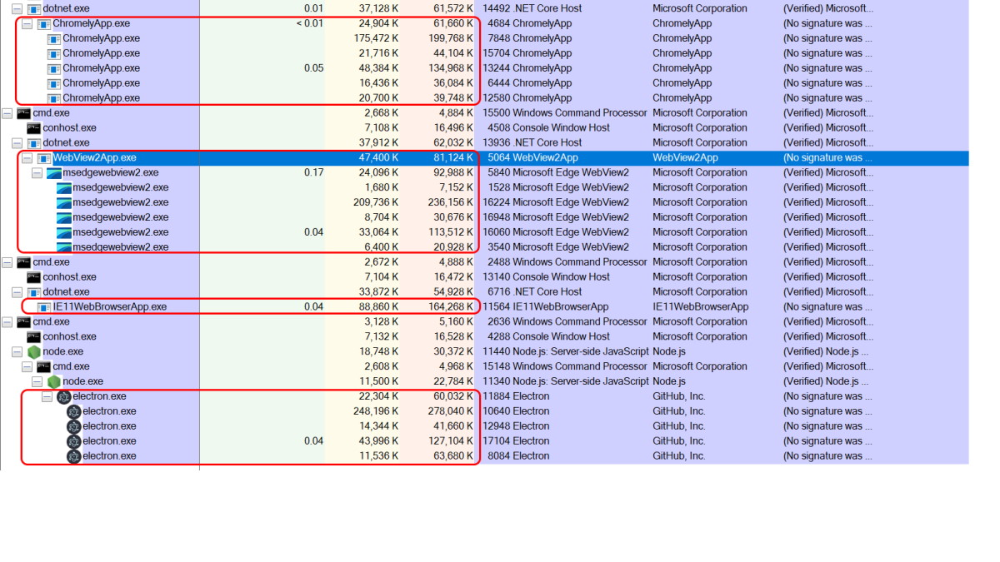

## Comparing working memory sets of various WebView-based Windows Desktop apps

Each application simply loads [Bing home page](https://www.bing.com/):

|App|Working set size|
|---|----------------|
|[Legacy IE11 WebBrowser WPF](./IE11WebBrowserApp)|164MB|
|[MSEdge WebView2 WPF](./WebView2App)|582MB|
|[Chromely/CefSharp](./ChromelyApp)|516MB|
|[Electron v10](./ElectronApp)|570MB|

A screenshot of [Process Explorer](https://docs.microsoft.com/en-us/sysinternals/downloads/process-explorer):

